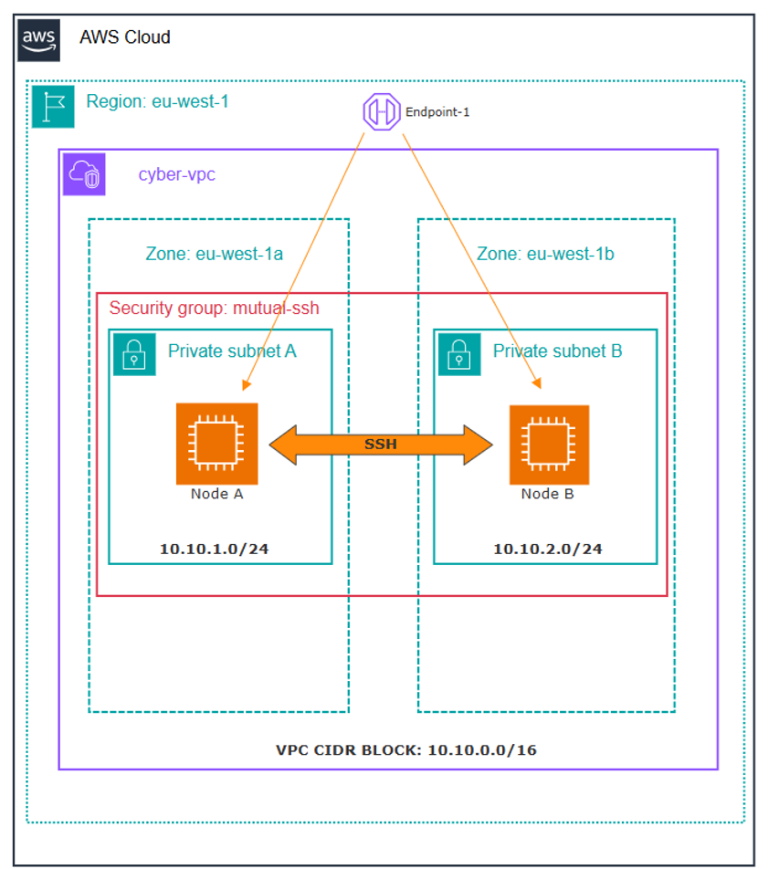

# DevOps Assigment 2
## Description

As part of the DevOps course, I created a Virtual Private Cloud (VPC) with two private subnets located in different Availability Zones. In each subnet, I launched an EC2 instance. The two instances were then connected via SSH.

Additionally, I configured remote state management using an S3 bucket and a DynamoDB table for state locking. This setup is very useful in team environments, where multiple users may work on the same infrastructure and need to avoid conflicts.
## Short Reflection
Terraform felt more developer-friendly due to its concise and readable HCL syntax. The ability to preview changes with terraform plan and apply them incrementally helped me understand what would be modified before actually making changes.

In comparison, CloudFormation manages state automatically inside AWS, which makes it easier to get started since there's no need to set up additional resources like S3 or DynamoDB. However, CloudFormation templates tend to be more verbose, and error messages can be harder to interpret.
## Diagram

